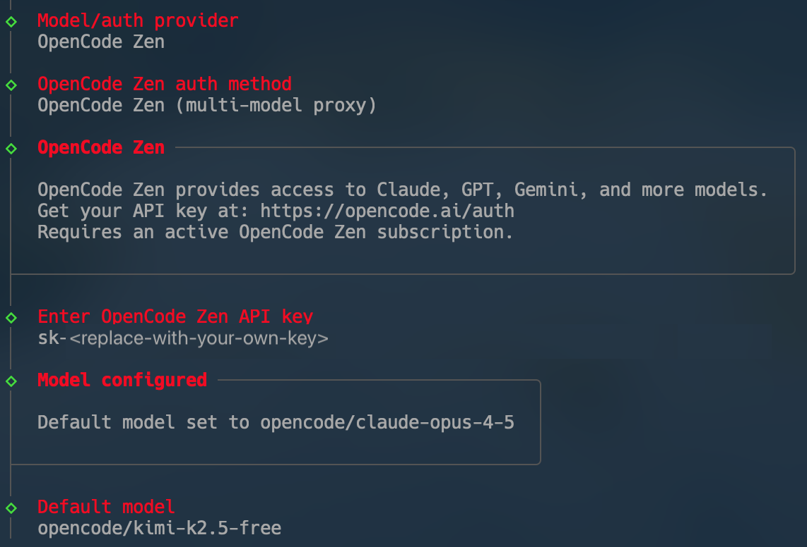

# OpenClaw Helm Chart

This repository contains the Helm chart for [OpenClaw](https://openclaw.ai/) (gateway). The chart deploys a single-instance StatefulSet with persistent storage and config/secrets wiring.

## Requirements

- Helm v3
- A Kubernetes cluster with PersistentVolume support (optional if persistence is disabled)

## Install

Charts are published as OCI artifacts in GHCR.

1) Create a Telegram bot via [@BotFather](https://t.me/BotFather):

   - Open Telegram and message [@BotFather](https://t.me/BotFather)
   - Send `/newbot` and follow the prompts to create your bot
   - Save the bot token provided: `export telegramBotToken=<your-token>`

1) Generate a gateway token:

   ```bash
   export gatewayToken=$(openssl rand -hex 32)
   ```

1) Install the chart:

   ```bash
   helm install openclaw oci://ghcr.io/feiskyer/openclaw-kubernetes/openclaw \
      --create-namespace --namespace openclaw \
      --set secrets.openclawGatewayToken=$gatewayToken \
      --set secrets.telegramBotToken=$telegramBotToken
   ```

1) (Optional) Provide additional large language model values (e.g. for Anthropic):

   ```bash
   helm install openclaw oci://ghcr.io/feiskyer/openclaw-kubernetes/openclaw \
      --create-namespace --namespace openclaw \
      --set secrets.openclawGatewayToken=$gatewayToken \
      --set secrets.telegramBotToken=$telegramBotToken \
      --set secrets.anthropicApiKey=<anthropicApiKey>
   ```

1) Access the portal:

   ```bash
   kubectl --namespace openclaw port-forward openclaw-0 18789:18789
   ```

   Then open <http://localhost:18789/?token=$gatewayToken> in your browser.

## Upgrade / Uninstall

```bash
# Upgrade
helm upgrade openclaw oci://ghcr.io/feiskyer/openclaw-kubernetes/openclaw \
  --namespace openclaw \
  --set secrets.openclawGatewayToken=$gatewayToken \
  --set secrets.telegramBotToken=$telegramBotToken

# Uninstall
helm uninstall openclaw --namespace openclaw
```

## FAQ

<details>
<summary>How to use a free model?</summary>

Run the onboard script and select **QWen** or **OpenCode Zen** provider, then select a free model from the list:

```bash
kubectl -n openclaw exec -it openclaw-0 -- node openclaw.mjs onboard
```

For example, selecting OpenCode Zen:



</details>

<details>
<summary>How to join the Moltbook community?</summary>

Send the following prompt to your OpenClaw agent:

```
Read https://moltbook.com/skill.md and follow the instructions to join Moltbook
```

</details>

<details>
<summary>How to modify configuration after deployment?</summary>

Run the onboard command interactively:

```bash
kubectl -n openclaw exec -it openclaw-0 -- node openclaw.mjs onboard
```

</details>

<details>
<summary>How to authorize Telegram users?</summary>

Configure the "Allow From" setting in **Channel -> Telegram** to add your user ID. You can query your Telegram user ID by messaging [@userinfobot](https://t.me/userinfobot).

</details>

<details>
<summary>How to fix "disconnected (1008): pairing required" error?</summary>

List pending device requests and approve your device:

```bash
kubectl -n openclaw exec -it openclaw-0 -- node dist/index.js devices list
kubectl -n openclaw exec -it openclaw-0 -- node dist/index.js devices approve <your-request-id>
```

</details>

## Values and configuration

Key values:

- `image.*`: container image settings.
- `replicaCount`: must be `1` (OpenClaw is single-instance).
- `service.*`: Service type/ports/annotations.
- `resources.*`: CPU/memory requests/limits.
- `persistence.*`: PVC configuration.
- `secrets.*`: API keys and gateway token, or reference an existing secret.
- `openclaw.config`: OpenClaw gateway configuration (rendered into `openclaw.json`).
- `extraEnv`, `extraEnvFrom`, `extraVolumes`, `extraVolumeMounts`, `initContainers`, `sidecars`: extensions.

Values files provided:

- `values-minimal.yaml`: minimal defaults for testing.
- `values-development.yaml`: development-focused defaults.
- `values-production.yaml`: production-leaning defaults.

See `values.yaml` for the full list and `values.schema.json` for schema validation.

## Persistence and data directory

- The main container mounts the data volume at `/home/node/.openclaw`.
- `OPENCLAW_DATA_DIR` is set to `/home/node/.openclaw`.
- An init container seeds the volume from the image (`/home/node/.openclaw`) when the PVC is empty.
- The config file is stored at `/home/node/.openclaw/openclaw.json` and is seeded from the configmap (`/etc/openclaw/openclaw.json`) if it does not exist.
- If `persistence.enabled` is `false`, the chart uses an `emptyDir` volume instead of a PVC.
- To use an existing claim, set `persistence.existingClaim`.

## Secrets

You can either:

1) Provide values under `secrets.*` and let the chart create a secret.
2) Reference an existing secret via `secrets.existingSecret`.

Expected keys if using an existing secret:

- `ANTHROPIC_API_KEY` (optional)
- `OPENAI_API_KEY` (optional)
- `DISCORD_BOT_TOKEN` (optional)
- `TELEGRAM_BOT_TOKEN` (optional)
- `SLACK_BOT_TOKEN` (optional)
- `SLACK_APP_TOKEN` (optional)
- `OPENCLAW_GATEWAY_TOKEN` (required)

`secrets.openclawGatewayToken` is required when not using `secrets.existingSecret`.

## Development

Lint the chart:

```bash
./scripts/helm-lint.sh
```

Render templates with each values file:

```bash
./scripts/helm-test.sh
```

You can also run ad-hoc commands:

```bash
helm template openclaw . -f values.yaml
```

## Publishing (maintainers)

This repo publishes charts to GHCR as OCI artifacts on pushes to `main`.

Manual publish steps:

```bash
helm registry login ghcr.io -u <github-username> -p <github-token>
./scripts/publish-chart.sh
```

Environment overrides:

- `CHART_DIR`: chart directory (default: `.`)
- `CHART_OCI_REPO`: OCI repo (default: `ghcr.io/feiskyer/openclaw-kubernetes` based on `GITHUB_REPOSITORY`)

Remember to bump `Chart.yaml` version for each release; OCI registries do not accept duplicate versions.

## Links

- [OpenClaw](https://openclaw.ai/) (formerly Moltbot/Clawdbot)
- [AI Agent Community](https://www.moltbook.com/)
- [Source Code](https://github.com/openclaw/openclaw)

## Acknowledgments

This chart is forked from [openclaw/openclaw#2562](https://github.com/openclaw/openclaw/pull/2562/). Unfortunately, the original PR was not accepted by the OpenClaw maintainers, so this repository was created with further adjustments and improvements. Many thanks to the original author for the initial draft PR—hopefully this will become part of the official OpenClaw repository in the future.

## License

This project is licensed under the [MIT License](LICENSE).
