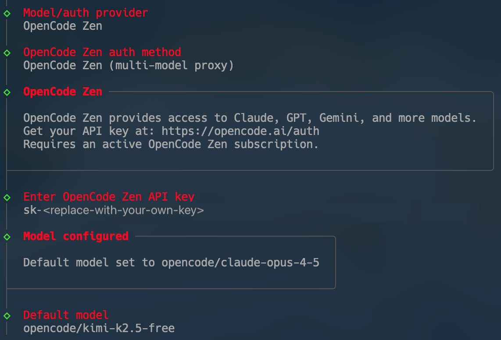

# OpenClaw Helm Chart

Helm chart for [OpenClaw](https://openclaw.ai/) (gateway). Deploys a single-instance StatefulSet with persistent storage, secrets management, and an optional [LiteLLM](https://github.com/BerriAI/litellm) proxy for model routing.

## Requirements

- Helm v3
- A Kubernetes cluster with PersistentVolume support (optional if persistence is disabled)

## Install

Charts are published as OCI artifacts in GHCR.

1) Create a Telegram bot via [@BotFather](https://t.me/BotFather):

   - Message [@BotFather](https://t.me/BotFather), send `/newbot`, and follow the prompts
   - Save the token: `export telegramBotToken=<your-token>`

1) Generate a gateway token:

   ```bash
   export gatewayToken=$(openssl rand -hex 32)
   ```

1) Install the chart:

   ```bash
   helm install openclaw oci://ghcr.io/feiskyer/openclaw-kubernetes/openclaw \
      --create-namespace --namespace openclaw \
      --set secrets.openclawGatewayToken=$gatewayToken \
      --set secrets.telegramBotToken=$telegramBotToken
   ```

   This deploys the OpenClaw gateway and a LiteLLM proxy with Github Copilot provider (enabled by default).

1) (Alternative) Use a specific model provider (e.g. Anthropic):

   ```bash
   helm install openclaw oci://ghcr.io/feiskyer/openclaw-kubernetes/openclaw \
      --create-namespace --namespace openclaw \
      --set secrets.openclawGatewayToken=$gatewayToken \
      --set secrets.telegramBotToken=$telegramBotToken \
      --set litellm.secrets.provider=anthropic \
      --set litellm.secrets.apiKey=<your-api-key> \
      --set litellm.secrets.apiBase=<your-api-base> \
      --set litellm.model=claude-opus-4.6
   ```

1) Access the portal:

   ```bash
   kubectl --namespace openclaw port-forward openclaw-0 18789:18789
   ```

   Then open <http://localhost:18789/?token=$gatewayToken> in your browser.

1) (Optional) View the Chrome browser GUI via noVNC:

   ```bash
   kubectl --namespace openclaw port-forward openclaw-0 6080:6080
   ```

   Then open <http://localhost:6080/vnc.html> in your browser to see the Chrome desktop.

## Browser GUI

Chrome runs in headed mode inside a virtual display. Access the desktop via [noVNC](https://novnc.com/) on port **6080** to watch browser automation in real time.

<details>
<summary>How it works</summary>

supervisord manages the full GUI stack inside the container:

1. **Xvfb** — virtual framebuffer (display `:99`)
2. **Fluxbox** — lightweight window manager
3. **x11vnc** — VNC server on port `5900` (localhost only)
4. **websockify + noVNC** — bridges VNC to WebSocket, served on port `6080`
5. **OpenClaw gateway** — launches Chrome against `DISPLAY=:99`

All processes auto-restart on failure.

Environment variables:

| Variable | Default | Description |
|---|---|---|
| `DISPLAY_NUM` | `99` | X display number |
| `SCREEN_RESOLUTION` | `1920x1080x24` | Virtual screen resolution |
| `VNC_PORT` | `5900` | Internal VNC port (not exposed externally) |
| `NOVNC_PORT` | `6080` | noVNC web UI port |

</details>

## Memory

OpenClaw supports **semantic memory search** over the agent workspace (`MEMORY.md` + `memory/*.md` + session transcripts). When configured, the agent can recall prior conversations, decisions, and notes using natural-language queries via the `memory_search` tool.

Memory search requires an **embedding service** (e.g. OpenAI, Azure, Cohere) to generate vector embeddings for indexed content. Embedding credentials are stored in the **LiteLLM Secret** and routed through the LiteLLM proxy — they never appear in `openclaw.json` (a plain ConfigMap). Configure via `litellm.secrets.embedding*` values:

```bash
helm install openclaw oci://ghcr.io/feiskyer/openclaw-kubernetes/openclaw \
  --create-namespace --namespace openclaw \
  --set secrets.openclawGatewayToken=$gatewayToken \
  --set litellm.secrets.provider=anthropic \
  --set litellm.secrets.apiKey=<your-api-key> \
  --set litellm.model=claude-opus-4.6 \
  --set secrets.telegramBotToken=$telegramBotToken \
  --set litellm.secrets.embeddingProvider=openai \
  --set litellm.secrets.embeddingApiKey=<your-openai-api-key>
```

To use a custom embedding endpoint (e.g. Azure OpenAI or a self-hosted service), also set `embeddingApiBase`:

```bash
  --set litellm.secrets.embeddingApiBase=https://my-endpoint.openai.azure.com/
```

<details>
<summary>Configuration details</summary>

| Value | Default | Description |
|-------|---------|-------------|
| `litellm.secrets.embeddingProvider` | `openai` | Embedding provider (`openai`, `azure`, `cohere`, `voyage`, `mistral`, …) |
| `litellm.secrets.embeddingApiKey` | `""` | API key for the embedding provider (**required** to enable memory search) |
| `litellm.secrets.embeddingApiBase` | `""` | Base URL for the embedding provider (optional; omit for default provider endpoint) |
| `openclaw.memorySearch.model` | `text-embedding-3-small` | Embedding model name |
| `openclaw.memorySearch.extraPaths` | `[]` | Additional paths to index (directories or files, Markdown only) |

Memory search is **only enabled** when `litellm.enabled` is `true` and `litellm.secrets.embeddingApiKey` is set. The embedding provider may be different from the main chat model provider — for example, you can run `github_copilot` for chat and `openai` for embeddings. When enabled, the chart automatically configures:

- **Hybrid search** (BM25 keyword + vector similarity) with 70/30 weighting
- **Embedding cache** (up to 50,000 entries) to avoid re-embedding unchanged content
- **Session memory** indexing for conversation recall
- **File watching** for automatic re-indexing on workspace changes

</details>

<details>
<summary>Index and status commands</summary>

After deploying with memory search enabled, it is recommended to use these commands to manage the memory index (especially when you have set memorySearch.extraPaths) :

**Build the index** (run after first adding files to the workspace):

```bash
kubectl -n openclaw exec -it openclaw-0 -- openclaw memory index --verbose
```

This scans `MEMORY.md`, `memory/*.md`, and any `extraPaths`, generates embeddings, and stores them in a local SQLite database. The `--verbose` flag prints per-phase details including provider, model, sources, and batch activity.

**Check memory status:**

```bash
kubectl -n openclaw exec -it openclaw-0 -- openclaw memory status
```

Shows the current state of the memory index: indexed file count, embedding provider/model, store location, and whether the index is up-to-date. Add `--deep` to probe vector and embedding availability, or `--deep --index` to also trigger a reindex if the store is dirty.

</details>

## Upgrade / Uninstall

```bash
# Upgrade
helm upgrade openclaw oci://ghcr.io/feiskyer/openclaw-kubernetes/openclaw \
  --namespace openclaw \
  --set secrets.openclawGatewayToken=$gatewayToken \
  --set secrets.telegramBotToken=$telegramBotToken

# Uninstall
helm uninstall openclaw --namespace openclaw
```

## LiteLLM Proxy

The chart includes a [LiteLLM](https://github.com/BerriAI/litellm) proxy between OpenClaw and model providers, enabled by default (`litellm.enabled: true`).

LiteLLM provides:

1. **Provider decoupling** -- OpenClaw talks only to the local LiteLLM endpoint. Switching providers (e.g. GitHub Copilot to Anthropic) requires only a Helm values change.
2. **Credential isolation** -- API keys (both chat model and embedding) live in the LiteLLM Secret and are never injected into the OpenClaw container or ConfigMap. OpenClaw authenticates to LiteLLM with a dummy token over the cluster-internal network.

<details>
<summary>How it works</summary>

- LiteLLM runs as a separate Deployment with its own Service (`<release>-litellm:4000`)
- The OpenClaw ConfigMap (`openclaw.json`) is automatically configured to route model requests through the LiteLLM proxy
- LiteLLM handles provider-specific API translation (Anthropic, OpenAI, GitHub Copilot, etc.)
- Provider credentials live exclusively in the `<release>-litellm` Secret and are only mounted into the LiteLLM pod

</details>

<details>
<summary>Provider configuration</summary>

Set the model provider via `litellm.secrets`:

| Provider | `litellm.secrets.provider` | `litellm.secrets.apiKey` | Notes |
|---|---|---|---|
| GitHub Copilot | `github_copilot` (default) | Not needed | Uses editor auth headers |
| Anthropic | `anthropic` | Required | Direct Anthropic API |
| OpenAI | `openai` | Required | Direct OpenAI API |

For providers with custom endpoints, set `litellm.secrets.apiBase` to the base URL.

</details>

<details>
<summary>Model selection</summary>

Set `litellm.model` to configure which model to proxy (default: `claude-opus-4.6`). The API format in `openclaw.json` is automatically determined:

- Models containing `claude` (e.g. `claude-opus-4.6`, `vertex_ai/claude-opus-4-6`) use `anthropic-messages`
- Models prefixed with `gpt` use `openai-responses`
- All other models use `openai-completions`

</details>

<details>
<summary>Custom LiteLLM config</summary>

To override the built-in config entirely, set `litellm.configOverride` with your complete LiteLLM YAML config.

</details>

## Values and configuration

### Quick reference

| Value | Default | Description |
|-------|---------|-------------|
| `secrets.openclawGatewayToken` | `""` | **Required.** Gateway authentication token |
| `litellm.enabled` | `true` | Enable LiteLLM proxy for model routing |
| `litellm.model` | `claude-opus-4.6` | Model to proxy through LiteLLM |
| `litellm.secrets.provider` | `github_copilot` | Model provider (`github_copilot`, `anthropic`, `openai`) |
| `persistence.enabled` | `true` | Enable persistent storage |
| `persistence.size` | `10Gi` | Storage size for OpenClaw data |
| `ingress.enabled` | `false` | Enable Ingress for external access |
| `service.type` | `ClusterIP` | Service type (`ClusterIP`, `NodePort`, `LoadBalancer`) |

See dedicated sections below for [Secrets](#secrets), [Messaging Platforms](#messaging-platforms), [Web Search](#web-search), and [LiteLLM Proxy](#litellm-proxy).

<details>
<summary>Image and replicas</summary>

| Value | Default | Description |
|-------|---------|-------------|
| `replicaCount` | `1` | Must be 1 (OpenClaw is single-instance) |
| `image.repository` | `ghcr.io/feiskyer/openclaw-gateway` | Container image |
| `image.tag` | `""` | Image tag (defaults to chart appVersion) |
| `image.pullPolicy` | `Always` | Image pull policy |
| `imagePullSecrets` | `[]` | Pull secrets for private registries |

</details>

<details>
<summary>Service and networking</summary>

| Value | Default | Description |
|-------|---------|-------------|
| `service.type` | `ClusterIP` | Service type |
| `service.port` | `18789` | Service port |
| `service.nodePort` | `null` | NodePort (when type is NodePort) |
| `ingress.enabled` | `false` | Enable Ingress |
| `ingress.className` | `""` | Ingress class name |
| `ingress.hosts` | `[{host: openclaw.local, ...}]` | Ingress hosts |
| `ingress.tls` | `[]` | TLS configuration |

</details>

<details>
<summary>Resources and probes</summary>

| Value | Default | Description |
|-------|---------|-------------|
| `resources.requests.cpu` | `250m` | CPU request |
| `resources.requests.memory` | `1Gi` | Memory request |
| `resources.limits.cpu` | `2000m` | CPU limit |
| `resources.limits.memory` | `8Gi` | Memory limit |
| `livenessProbe.enabled` | `true` | Enable liveness probe |
| `readinessProbe.enabled` | `true` | Enable readiness probe |
| `startupProbe.enabled` | `false` | Enable startup probe |

</details>

<details>
<summary>Service account and security</summary>

| Value | Default | Description |
|-------|---------|-------------|
| `serviceAccount.create` | `true` | Create service account |
| `serviceAccount.role` | `""` | Bind to ClusterRole (`view`, `cluster-admin`, or empty) |
| `podSecurityContext.runAsNonRoot` | `true` | Run as non-root user |
| `securityContext.allowPrivilegeEscalation` | `true` | Allow privilege escalation (required for sudo) |
| `securityContext.capabilities.add` | `[CAP_SETUID, CAP_SETGID]` | Capabilities for sudo |

</details>

<details>
<summary>Scheduling and availability</summary>

| Value | Default | Description |
|-------|---------|-------------|
| `nodeSelector` | `{}` | Node selector |
| `tolerations` | `[]` | Pod tolerations |
| `affinity` | `{}` | Pod affinity rules |
| `topologySpreadConstraints` | `[]` | Topology spread constraints |
| `podDisruptionBudget.enabled` | `false` | Enable PDB |

</details>

<details>
<summary>Extensions</summary>

| Value | Default | Description |
|-------|---------|-------------|
| `extraEnv` | `[]` | Extra environment variables |
| `extraEnvFrom` | `[]` | Extra env from secrets/configmaps |
| `extraVolumes` | `[]` | Extra volumes |
| `extraVolumeMounts` | `[]` | Extra volume mounts |
| `initContainers` | `[]` | Additional init containers |
| `sidecars` | `[]` | Sidecar containers |

</details>

### Preset values files

| File | Use case |
|------|----------|
| `values.yaml` | Full defaults with security hardening |
| `values-minimal.yaml` | CI/testing (no security context, no persistence) |
| `values-development.yaml` | Local dev (NodePort, relaxed security, debug logging) |
| `values-production.yaml` | Production (Ingress + TLS, anti-affinity, backup annotations) |

## Persistence and data directory

Persistence is enabled by default (`persistence.enabled: true`) using the cluster's default StorageClass.

<details>
<summary>Storage configuration details</summary>

- Data volume mounted at `/home/vibe/.openclaw` (`OPENCLAW_STATE_DIR`).
- An init container seeds the volume from the image when the PVC is empty.
- Config (`openclaw.json`) is seeded from the ConfigMap if not already present.
- When `persistence.enabled` is `false`, an `emptyDir` volume is used instead of a PVC.
- To use a pre-provisioned volume, set `persistence.existingClaim`.
- LiteLLM has its own PVC (`litellm.persistence.*`) mounted at `~/.config/litellm`.

</details>

<details>
<summary>Azure File storage (permission fix)</summary>

Azure File (SMB) mounts don't support POSIX ownership natively, so the default StorageClass will cause permission errors for the non-root `vibe` user (UID 1024). Use the provided custom StorageClass that sets the correct `uid`/`gid` and file modes via mount options.

1) Create the StorageClass:

   ```bash
   kubectl apply -f https://raw.githubusercontent.com/feiskyer/openclaw-kubernetes/main/examples/azurefile-storageclass.yaml
   ```

2) Install the chart with both PVs using the custom StorageClass and `ReadWriteMany` access mode:

   ```bash
   helm install openclaw oci://ghcr.io/feiskyer/openclaw-kubernetes/openclaw \
      --create-namespace --namespace openclaw \
      --set secrets.openclawGatewayToken=$gatewayToken \
      --set secrets.telegramBotToken=$telegramBotToken \
      --set persistence.storageClass=azurefile-openclaw \
      --set persistence.accessMode=ReadWriteMany \
      --set litellm.persistence.storageClass=azurefile-openclaw \
      --set litellm.persistence.accessMode=ReadWriteMany
   ```

The StorageClass configures:

- `uid=1024` / `gid=1024` — matches the `vibe` user inside the container
- `dir_mode=0755` / `file_mode=0755` — least-privilege file permissions
- `mfsymlinks` — enables symlink support (required for node_modules)
- `nobrl` — disables byte-range locks (avoids issues with SQLite)
- `Premium_LRS` — premium SSD-backed Azure File shares

</details>

## Secrets

Two modes:

1) Set values under `secrets.*` and let the chart create a Secret.
2) Reference an existing secret via `secrets.existingSecret`.

<details>
<summary>Expected keys for an existing secret</summary>

- `OPENCLAW_GATEWAY_TOKEN` (required)
- `TELEGRAM_BOT_TOKEN` (optional)
- `DISCORD_BOT_TOKEN` (optional)
- `SLACK_BOT_TOKEN` (optional)
- `SLACK_APP_TOKEN` (optional)
- `FEISHU_APP_ID` (optional)
- `FEISHU_APP_SECRET` (optional)
- `MSTEAMS_APP_ID` (optional)
- `MSTEAMS_APP_PASSWORD` (optional)
- `MSTEAMS_TENANT_ID` (optional)
- `BRAVE_API_KEY` (optional)
- `PERPLEXITY_API_KEY` (optional)

</details>

`secrets.openclawGatewayToken` is required when not using `secrets.existingSecret`.

LiteLLM has its own secret (`<release>-litellm`) configured via `litellm.secrets.*`:

| Key | Description |
|-----|-------------|
| `apiKey` | API key for the main chat model provider |
| `apiBase` | Base URL for the main chat model provider (optional) |
| `embeddingApiKey` | API key for the embedding provider (enables memory search when set) |
| `embeddingApiBase` | Base URL for the embedding provider (optional) |

## Messaging Platforms

OpenClaw supports multiple messaging platforms. Configure credentials via `secrets.*` values or an existing secret.

<details>
<summary>Discord</summary>

| Value | Environment Variable | Description |
|-------|---------------------|-------------|
| `secrets.discordBotToken` | `DISCORD_BOT_TOKEN` | Bot token from Discord Developer Portal |

```bash
helm install openclaw oci://ghcr.io/feiskyer/openclaw-kubernetes/openclaw \
  --set secrets.openclawGatewayToken=$gatewayToken \
  --set secrets.discordBotToken=<your-discord-bot-token>
```

📖 [Discord Setup Guide](https://docs.openclaw.ai/channels/discord)

</details>

<details>
<summary>Telegram</summary>

| Value | Environment Variable | Description |
|-------|---------------------|-------------|
| `secrets.telegramBotToken` | `TELEGRAM_BOT_TOKEN` | Bot token from [@BotFather](https://t.me/BotFather) |
| `secrets.telegramTokenFile` | — | File path to read bot token from (alternative to env var) |

```bash
helm install openclaw oci://ghcr.io/feiskyer/openclaw-kubernetes/openclaw \
  --set secrets.openclawGatewayToken=$gatewayToken \
  --set secrets.telegramBotToken=<your-telegram-bot-token>
```

For production deployments, consider using `telegramTokenFile` instead of `telegramBotToken` to avoid exposing the token in pod specs. Mount a Kubernetes Secret as a file and point `telegramTokenFile` to it:

```bash
# Create a secret with the token file
kubectl -n openclaw create secret generic telegram-token \
  --from-literal=token=<your-telegram-bot-token>

# Install with tokenFile + volume mount
helm install openclaw oci://ghcr.io/feiskyer/openclaw-kubernetes/openclaw \
  --set secrets.openclawGatewayToken=$gatewayToken \
  --set secrets.telegramTokenFile=/etc/openclaw-secrets/token \
  --set 'extraVolumes[0].name=telegram-token' \
  --set 'extraVolumes[0].secret.secretName=telegram-token' \
  --set 'extraVolumeMounts[0].name=telegram-token' \
  --set 'extraVolumeMounts[0].mountPath=/etc/openclaw-secrets' \
  --set 'extraVolumeMounts[0].readOnly=true'
```

📖 [Telegram Setup Guide](https://docs.openclaw.ai/channels/telegram)

</details>

<details>
<summary>Slack</summary>

| Value | Environment Variable | Description |
|-------|---------------------|-------------|
| `secrets.slackBotToken` | `SLACK_BOT_TOKEN` | Bot user OAuth token (`xoxb-...`) |
| `secrets.slackAppToken` | `SLACK_APP_TOKEN` | App-level token (`xapp-...`) |

```bash
helm install openclaw oci://ghcr.io/feiskyer/openclaw-kubernetes/openclaw \
  --set secrets.openclawGatewayToken=$gatewayToken \
  --set secrets.slackBotToken=xoxb-... \
  --set secrets.slackAppToken=xapp-...
```

📖 [Slack Setup Guide](https://docs.openclaw.ai/channels/slack)

</details>

<details>
<summary>Feishu (Lark)</summary>

| Value | Environment Variable | Description |
|-------|---------------------|-------------|
| `secrets.feishuAppId` | `FEISHU_APP_ID` | App ID (`cli_xxx`) from Feishu Open Platform |
| `secrets.feishuAppSecret` | `FEISHU_APP_SECRET` | App Secret (keep private) |

```bash
helm install openclaw oci://ghcr.io/feiskyer/openclaw-kubernetes/openclaw \
  --set secrets.openclawGatewayToken=$gatewayToken \
  --set secrets.feishuAppId=cli_xxx \
  --set secrets.feishuAppSecret=<your-app-secret>
```

📖 [Feishu Setup Guide](https://docs.openclaw.ai/channels/feishu)

</details>

<details>
<summary>Microsoft Teams</summary>

| Value | Environment Variable | Description |
|-------|---------------------|-------------|
| `secrets.msteamsAppId` | `MSTEAMS_APP_ID` | Azure Bot Application ID |
| `secrets.msteamsAppPassword` | `MSTEAMS_APP_PASSWORD` | Client secret from Azure Portal |
| `secrets.msteamsTenantId` | `MSTEAMS_TENANT_ID` | Directory (tenant) ID |

```bash
helm install openclaw oci://ghcr.io/feiskyer/openclaw-kubernetes/openclaw \
  --set secrets.openclawGatewayToken=$gatewayToken \
  --set secrets.msteamsAppId=<azure-app-id> \
  --set secrets.msteamsAppPassword=<client-secret> \
  --set secrets.msteamsTenantId=<tenant-id>
```

📖 [Microsoft Teams Setup Guide](https://docs.openclaw.ai/channels/msteams)

</details>

## Web Search

OpenClaw supports web search via Brave or Perplexity. When an API key is configured, `tools.web.search` is automatically enabled in `openclaw.json`.

<details>
<summary>Brave Search</summary>

Structured results (title, URL, snippet) with a free tier available.

| Value | Environment Variable | Description |
|-------|---------------------|-------------|
| `secrets.braveApiKey` | `BRAVE_API_KEY` | Brave Search API key |

```bash
helm install openclaw oci://ghcr.io/feiskyer/openclaw-kubernetes/openclaw \
  --set secrets.openclawGatewayToken=$gatewayToken \
  --set secrets.braveApiKey=<your-brave-api-key>
```

</details>

<details>
<summary>Perplexity</summary>

AI-synthesized answers with citations from real-time web search.

| Value | Environment Variable | Description |
|-------|---------------------|-------------|
| `secrets.perplexityApiKey` | `PERPLEXITY_API_KEY` | Perplexity API key |

```bash
helm install openclaw oci://ghcr.io/feiskyer/openclaw-kubernetes/openclaw \
  --set secrets.openclawGatewayToken=$gatewayToken \
  --set secrets.perplexityApiKey=<your-perplexity-api-key>
```

</details>

📖 [Web Search Documentation](https://docs.openclaw.ai/tools/web)

## Development

```bash
# Lint the chart
./scripts/helm-lint.sh

# Render templates with each values file
./scripts/helm-test.sh

# Ad-hoc template rendering
helm template openclaw . -f values.yaml
```

<details>
<summary>Publishing</summary>

Charts are published to GHCR as OCI artifacts on pushes to `main`.

Manual publish:

```bash
helm registry login ghcr.io -u <github-username> -p <github-token>
./scripts/publish-chart.sh
```

Environment overrides:

- `CHART_DIR`: chart directory (default: `.`)
- `CHART_OCI_REPO`: OCI repo (default: `ghcr.io/feiskyer/openclaw-kubernetes` based on `GITHUB_REPOSITORY`)

Bump `Chart.yaml` version before each release; OCI registries reject duplicate versions.

</details>

## FAQ

<details>
<summary>Telegram fails with ENETUNREACH or network errors</summary>

On dual-stack clusters (IPv4 + IPv6), Node 22+ enables Happy Eyeballs (`autoSelectFamily`) which tries IPv6 first. If IPv6 is configured but unreachable, connections to `api.telegram.org` fail with `ENETUNREACH` before IPv4 can connect.

The chart handles this automatically via two mechanisms:
1. `NODE_OPTIONS=--dns-result-order=ipv4first` in the container env
2. `channels.telegram.network.autoSelectFamily: false` in `openclaw.json`

If you use a custom `openclaw.json` (not chart-managed), add the network config manually:

```json
{
  "channels": {
    "telegram": {
      "network": {
        "autoSelectFamily": false
      }
    }
  }
}
```

</details>

<details>
<summary>How to use a free model?</summary>

Run the onboard script and select **QWen** or **OpenCode Zen**, then pick a free model:

```bash
kubectl -n openclaw exec -it openclaw-0 -- node openclaw.mjs onboard
```

Example with OpenCode Zen:



</details>

<details>
<summary>How to join the Moltbook community?</summary>

Send this prompt to your OpenClaw agent:

```
Read https://moltbook.com/skill.md and follow the instructions to join Moltbook
```

</details>

<details>
<summary>How to modify configuration after deployment?</summary>

Run the onboard command:

```bash
kubectl -n openclaw exec -it openclaw-0 -- node openclaw.mjs onboard
```

</details>

<details>
<summary>How to authorize Telegram users?</summary>

Add your user ID in **Channel -> Telegram -> Allow From**. Get your ID by messaging [@userinfobot](https://t.me/userinfobot).

</details>

<details>
<summary>How to fix "disconnected (1008): pairing required" error?</summary>

List pending device requests and approve yours:

```bash
kubectl -n openclaw exec -it openclaw-0 -- node dist/index.js devices list
kubectl -n openclaw exec -it openclaw-0 -- node dist/index.js devices approve <your-request-id>
```

</details>

## Links

- [OpenClaw](https://openclaw.ai/) (formerly Moltbot/Clawdbot)
- [OpenClaw Documentation](https://docs.openclaw.ai/)
- [AI Agent Community](https://www.moltbook.com/)
- [Source Code](https://github.com/openclaw/openclaw)

## Acknowledgments

<details>
<summary>OpenClaw Project</summary>

This Helm chart deploys [OpenClaw](https://openclaw.ai/), an open-source personal AI assistant gateway. Thanks to the OpenClaw team for building and maintaining this project.

- [OpenClaw Website](https://openclaw.ai/)
- [OpenClaw Documentation](https://docs.openclaw.ai/)
- [OpenClaw Source Code](https://github.com/openclaw/openclaw)

</details>

<details>
<summary>Original Helm Chart PR</summary>

This chart is forked from [openclaw/openclaw#2562](https://github.com/openclaw/openclaw/pull/2562/). The original PR was not accepted upstream, so this repository continues the work with further improvements. Thanks to the original author for the initial draft.

</details>

## License

This project is licensed under the [MIT License](LICENSE).
